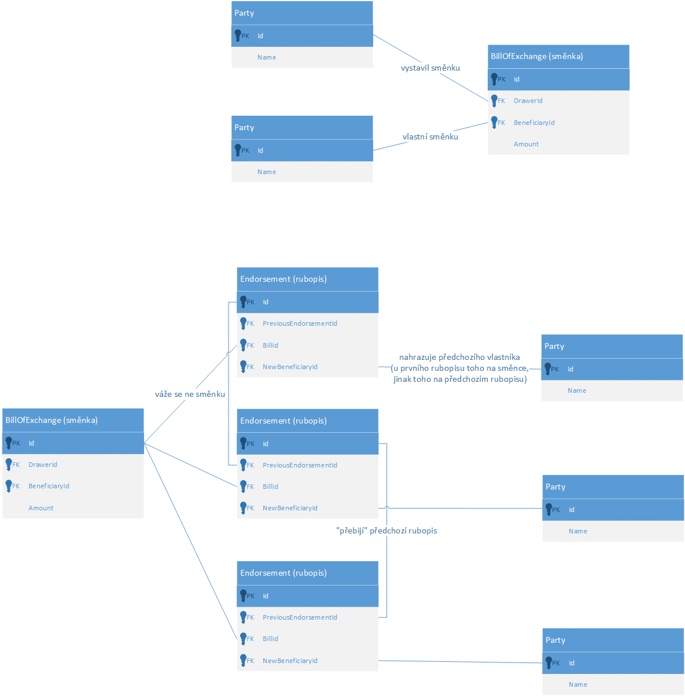

# Směnky API

Vaším úkolem je dokončit API server tak, aby poskytoval potřebná data pro klientskou část. Doplňte endpointy pro načtení:

- seznam všech osob (stránkovaný)
- seznam všech směnek (stránkovaný)
- úplného řadu danou směnku (tj. všechny rubopisy na dané směnce, seřazené)
- seznam všech směnek které daná osoba vystavila
- seznam všech směnek které daná osoba vlastní (tj. je v poslední beneficient)

**V případě, že jsou nějaká data poškozená (seznam na konci tohoto souboru), vyhoďte vyjímku s informací o daném problému s daty.**

Pokud nechcete použít REST, zajistěte ekvivalentní funkcionalitu.

**Bonusové body:**

- Pokrýt kód část unit testy
- Přidat logování přístupu do jednotlivých repositářů skrze AOP
- Správně dostát principům SOLID

## Co zde již je

Nachází se zde 4 projekty:

- BillsOfExchange - webová aplikace
- BillsOfExchange.Tests - prázdný projekt pro unit testy
- BillsOfExchange.DataProvider - projekt obsahující rozhraní a třídy pro načítání dat
- BillsOfExchange.DataProvider.Test - projekt s interními testy (neupravovat -> není součástí úkolu)

Můžete přidat libovolný počet dalších projektů. Neupravujte pouze DataProvider a jeho obsah. Typy z DataProvideru můžete rozšiřovat skrze dědičnost.

### BillsOfExchange.DataProvider

#### Model

V aplikace se nachází 3 základní datové třídy

- Party - reprezentuje nějakou osobu (může být buď tím kdo směnku vystavil, nebo její vlastník)
- BillOfExchange - reprezentuje směnku
- Endorsement - reprezentuje rubopis (tj. nástroj kterým se převádí směnka na dalšího vlastníka)

#### Repositář

Rozhraní:

- IEndorsementRepository
- IPartyRepository
- IBillOfExchangeRepository

Implementace:

- EndorsementRepository
- PartyRepository
- BillOfExchangeRepository

### Problémy s daty

- **Řad rubopisů pro směnku Id=8 je zacyklený (z Id=13 vede na Id=70 -> což dojde až k Id=13)**
- Směnka Id=2 má stejného DrawerId=13 jako BeneficiaryId=13 (tj. směnku vystavuje sám sobě)
- Řad indosamentů pro směnku Id=10 obsahuje 2x indosament s null předchozím (Id=5 a Id=10).
- První v řadu indosantů pro směnku Id=4 zaručeně (mohou být i další případy) dává NewBeneficiaryId=13 stejné jako BeneficiaryId=13 (tj. směnku postupuje sám sobě)
- Řad inodsamentů pro směnku Id=6 zaručeně (mohou být i další případy) obsahuje po sobě jdoucí indosamenty (Id=19 a Id=35) se stejným NewBeneficiaryId=9 (tj. směnku postupuje sám soně)
